# Actividad Monitorizacion
Para la instalación de zabbix ejecutamos los siguientes comandos.

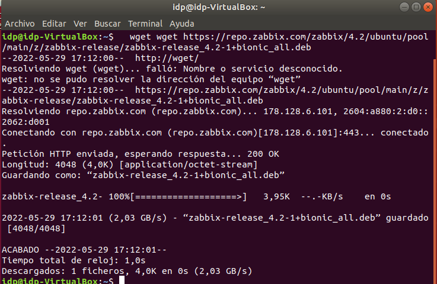

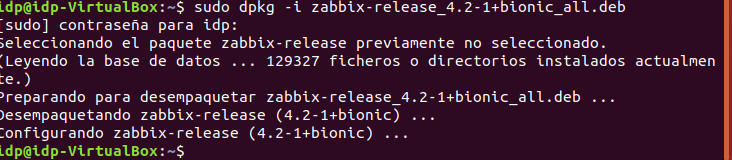

Ahora instalamos el sql.

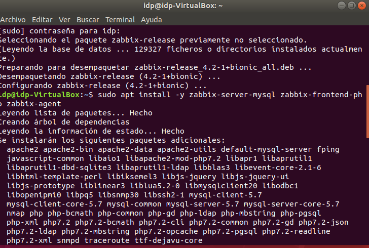

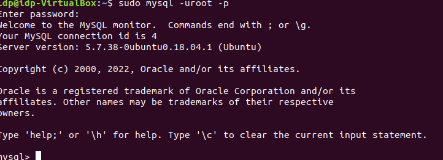

Creamos la base de datos.

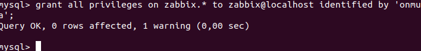

Entramos al siguiente fichero para modificar.

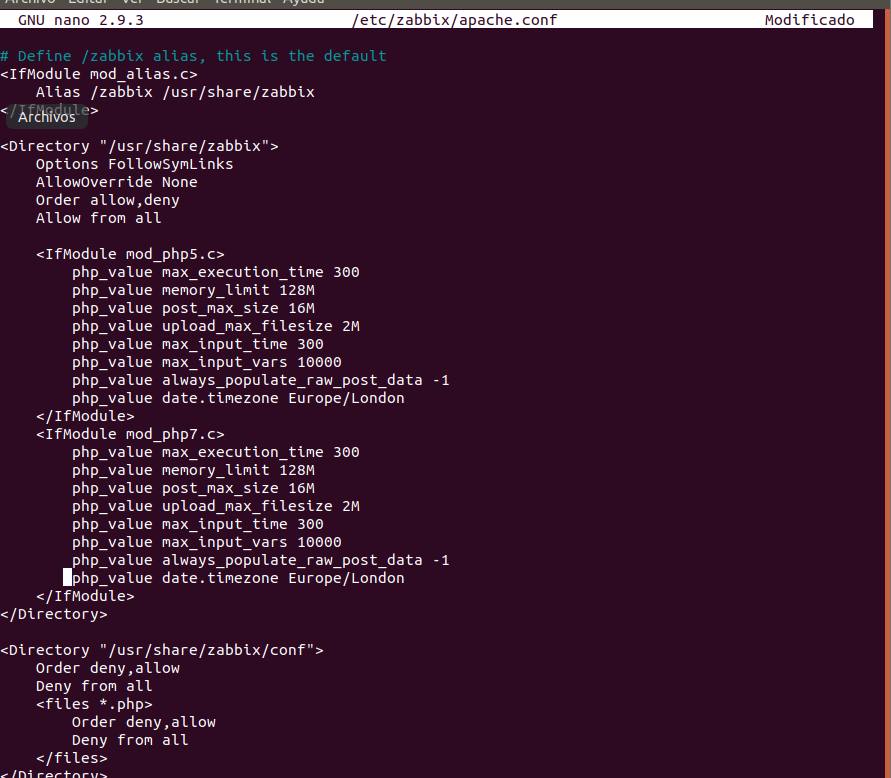

Ejecutamos el siguiente comando para aplicar la base de datos.

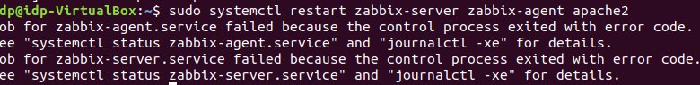

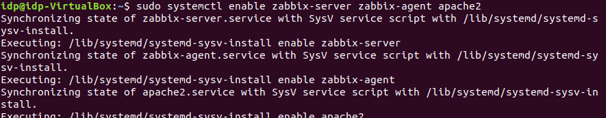

Vamos a localhost/zabbix.

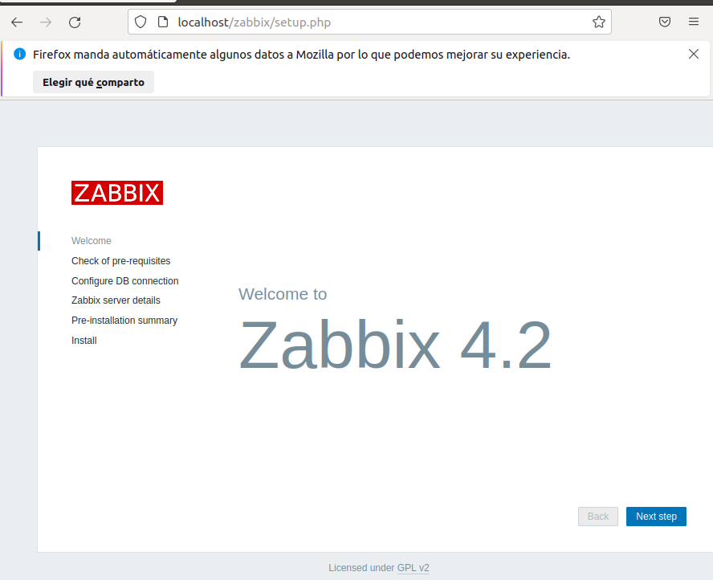

Siguiente.

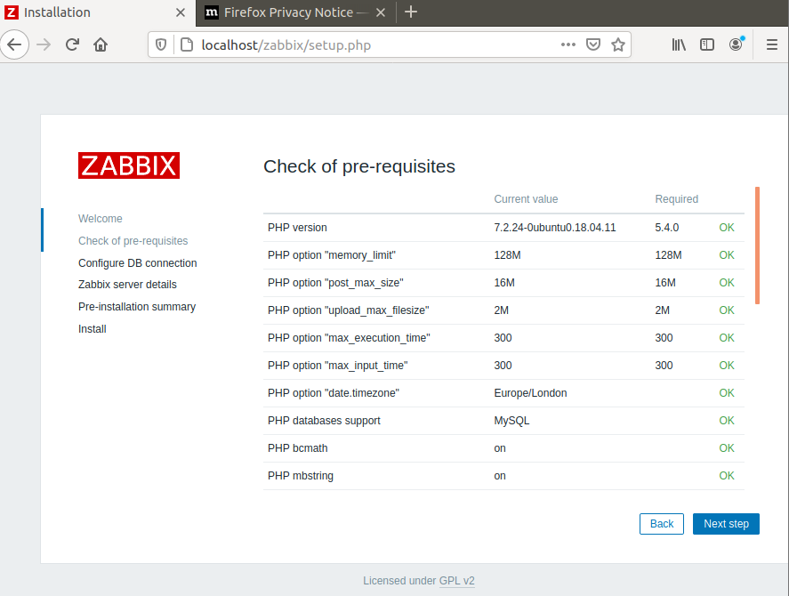

Ponemos la contraseña que indicamos en los anteriores pasos.

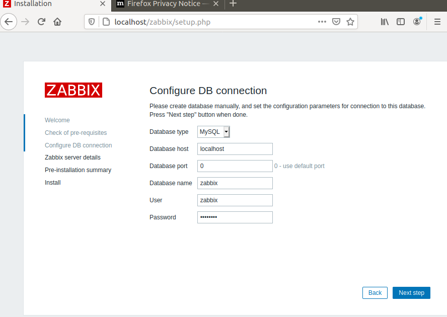

Ponemos de nombre Zabbix.

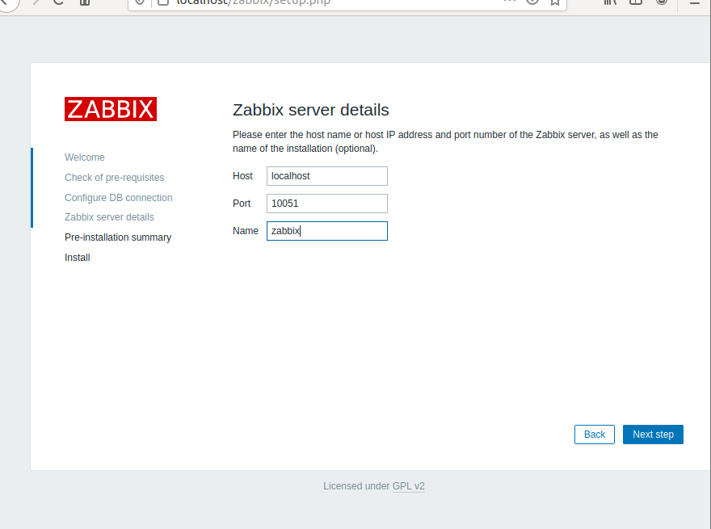

Y entramos con ADMIN y la contraseña.

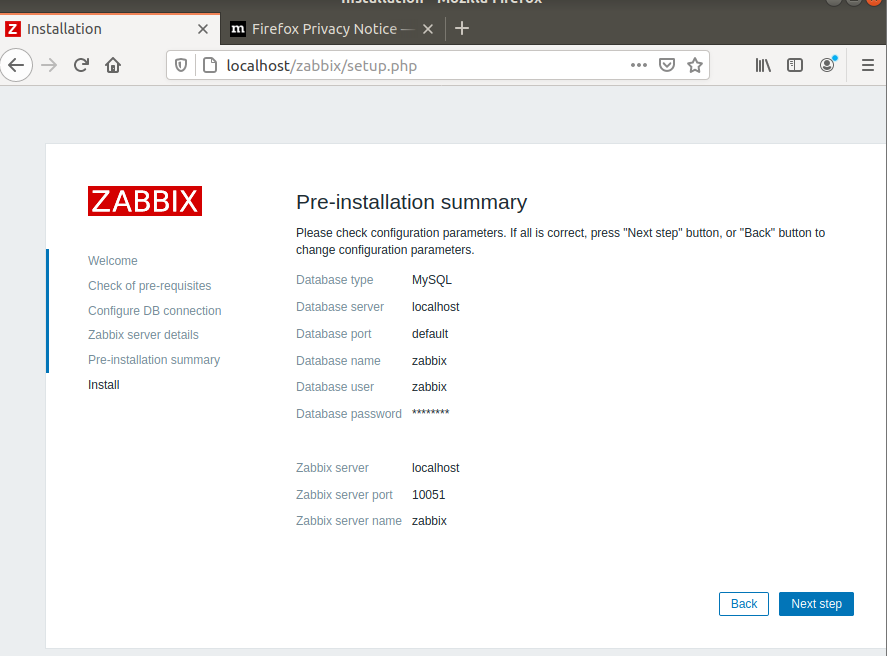

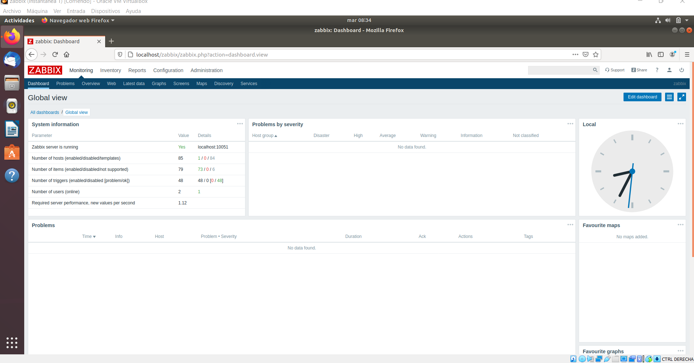

Monitorizar un equipo con zabbix, como necesitamos otra maquina y tienes instalado ubuntu ejecutamos los siguientes comandos.

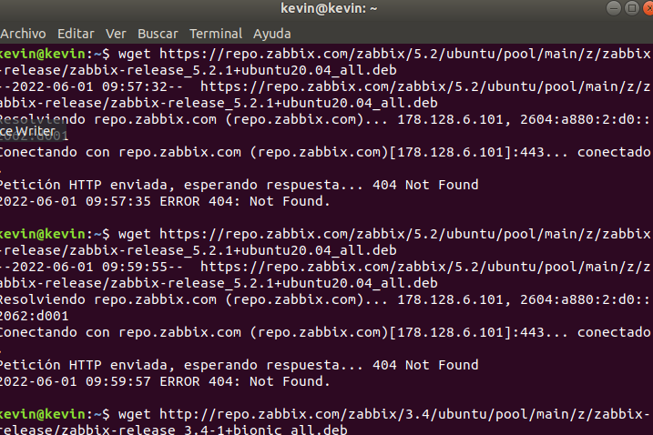

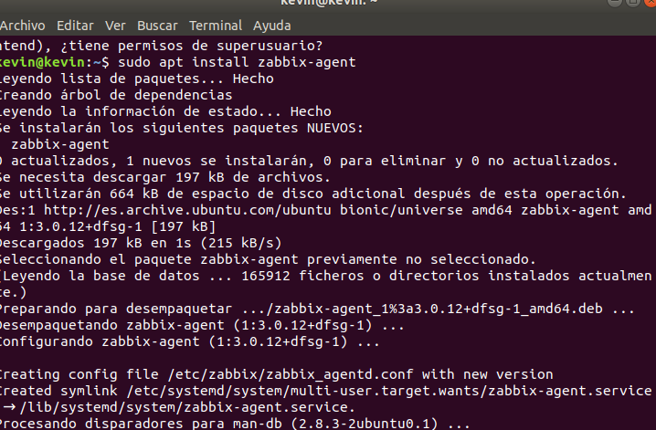

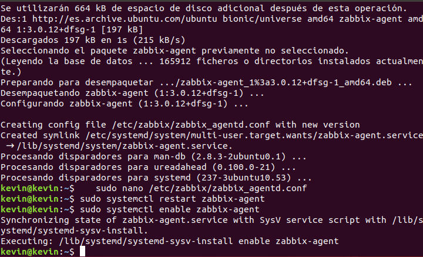

Vamos al servidor Zabbix y en configuración vamos al apartado de host y creamos un host con los datos de la otra maquina.

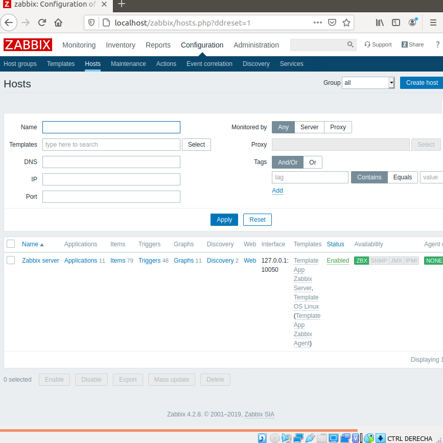

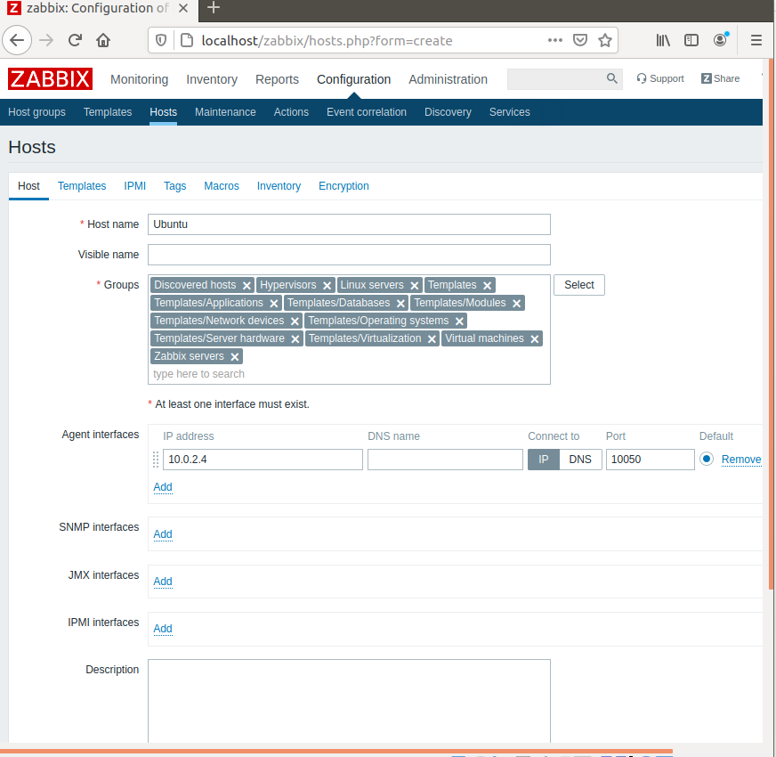

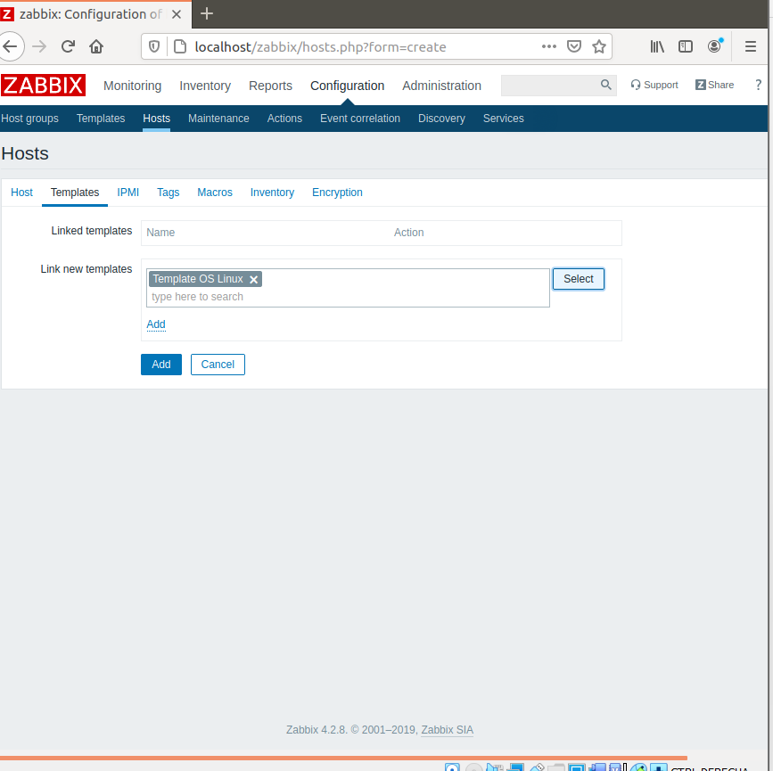

Y una vez hecho podemos ver los datos.

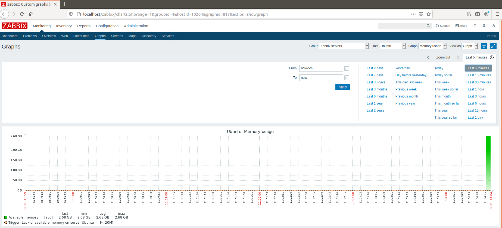
